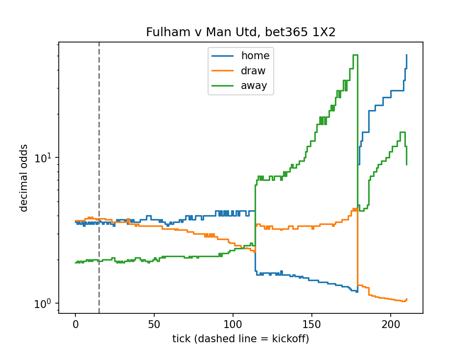

# Football odds movement chart (Python)

Chart every recorded price for a match — from the opening quote weeks before kickoff to the last in-play tick — with matplotlib.

Built on the [5DollarFootballAPI](https://5dollarfootballapi.com) odds history endpoint, which returns each price change with the minute and the score at that moment. Odds history needs the **Ultra plan** ($25/mo).



```
Fulham v Man Utd: 211 ticks, 15 pre-match, 196 in-play -> movement.png
```

See the walkthrough, with sample output: **[5dollarfootballapi.com/examples/odds-movement-chart](https://5dollarfootballapi.com/examples/odds-movement-chart)**

## Run it

1. Get an API key at [5dollarfootballapi.com](https://5dollarfootballapi.com). Free and Pro keys get a `403 insufficient_plan` on the history endpoint; it is an Ultra feature.
2. Install and run:

```bash
pip install -r requirements.txt
FIVEDOLLARFOOTBALL_API_KEY=fb_live_your_key python odds_movement.py
```

With no arguments it charts the most recent finished Premier League match. Other options:

```bash
python odds_movement.py --fixture 3197771745        # a specific match
python odds_movement.py --league "La Liga" --country ES
python odds_movement.py --bookmaker pinnacle        # any slug from /v1/bookmakers
python odds_movement.py --out fulham.png
```

## How it works

Three requests:

| Call | What it returns |
|---|---|
| `GET /v1/leagues?search=Premier League&country=GB-ENG` | The league id. Look it up once and keep it. |
| `GET /v1/leagues/{id}/fixtures?status=finished&per_page=1` | The most recent finished match. Fixtures come newest first. |
| `GET /v1/fixtures/{id}/odds/history?market=1x2&per_page=500` | Every recorded 1X2 price, oldest first. |

Each tick looks like this:

```json
{ "minute": 91, "home": 51, "draw": 1.071, "away": 9, "score": { "home": 1, "away": 1 }, "recorded_at": "2026-09-20T17:18:21+00:00" }
```

`minute` is `null` before kickoff, so the first tick with a minute marks kickoff. The script draws one step line per outcome on a log scale, which keeps the in-play swings readable.

Reference: [`/v1/fixtures/{id}/odds/history`](https://5dollarfootballapi.com/docs/odds-history) · [bookmaker coverage](https://5dollarfootballapi.com/docs#bookmakers) · [Python client](https://github.com/5dollarfootball-api/football-api-python-sdk)

## Take it further

- Change `market` to `asian`, `goalline` or `corner` to chart a line and its two prices instead.
- Each tick carries the score at that moment: mark the goals and measure how far each one moved the price.
- Turn each tick into probabilities (`1 / price`, normalized) to chart win probability instead of odds.
- Compare the first and the last pre-match tick for the opening-to-closing move.

Bookmakers other than Bet365 carry `1x2`, `asian`, `goalline` and `corner`; some of them quote 1X2 before kickoff only, so their chart ends at the dashed line.

## More examples

- [football-live-score-app](https://github.com/5dollarfootball-api/football-live-score-app) — a live scoreboard in one Node.js file
- [football-goal-alert-bot](https://github.com/5dollarfootball-api/football-goal-alert-bot) — goal alerts in Telegram or Discord
- [football-odds-backtest](https://github.com/5dollarfootball-api/football-odds-backtest) — simple bets settled at opening vs closing odds
- [football-corner-stats-table](https://github.com/5dollarfootball-api/football-corner-stats-table) — a league corner table from one call
- [All examples](https://5dollarfootballapi.com/examples)

## License

[MIT](LICENSE). Football data by [5DollarFootballAPI](https://5dollarfootballapi.com).
